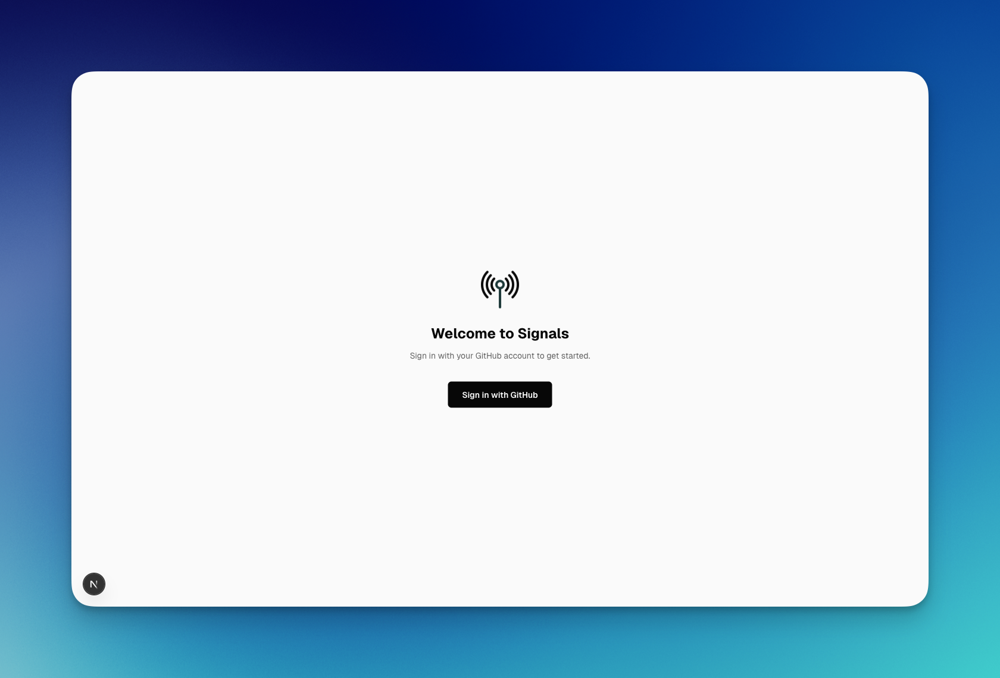
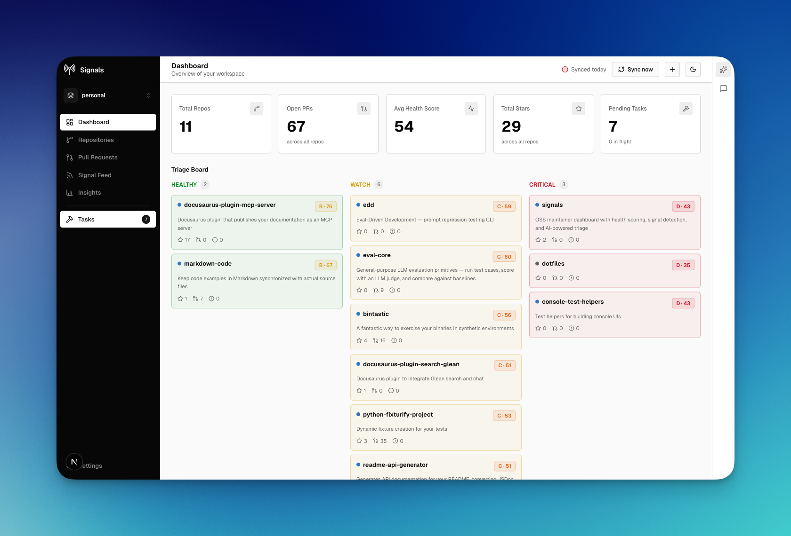
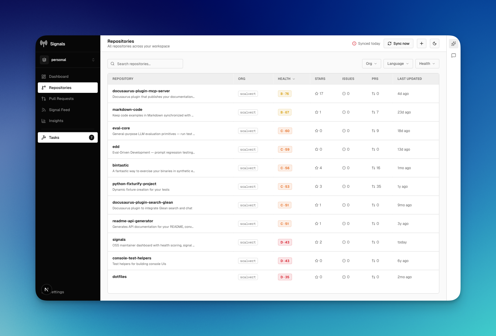
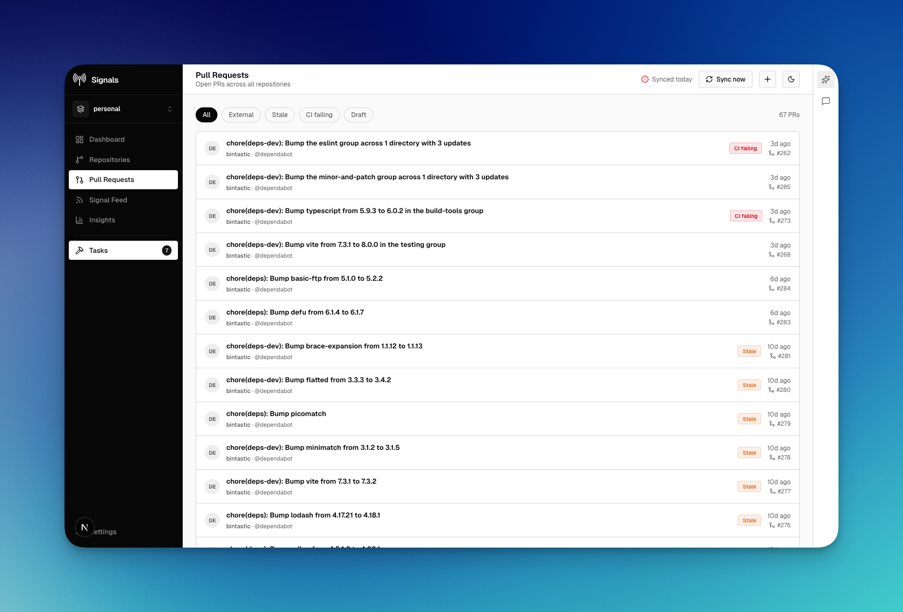
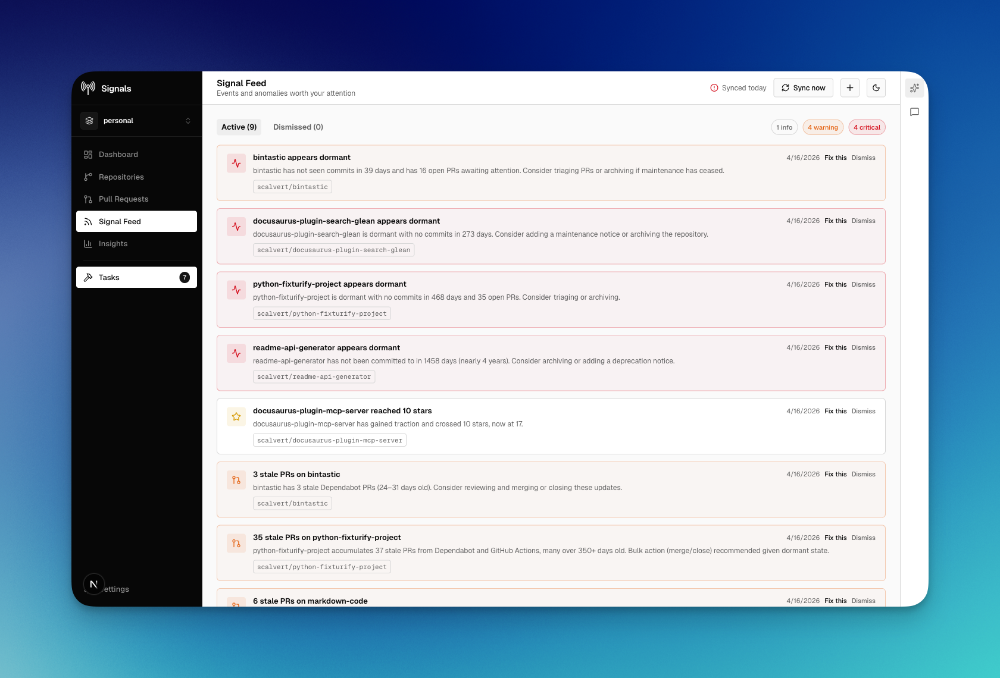
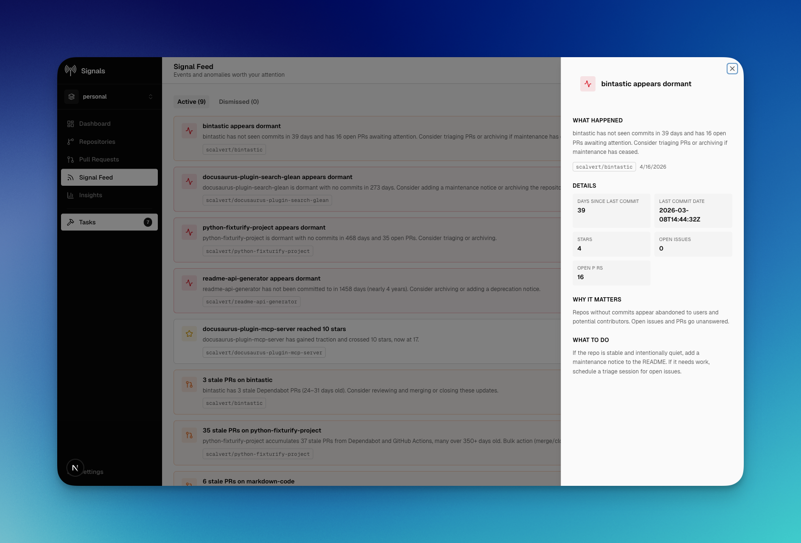
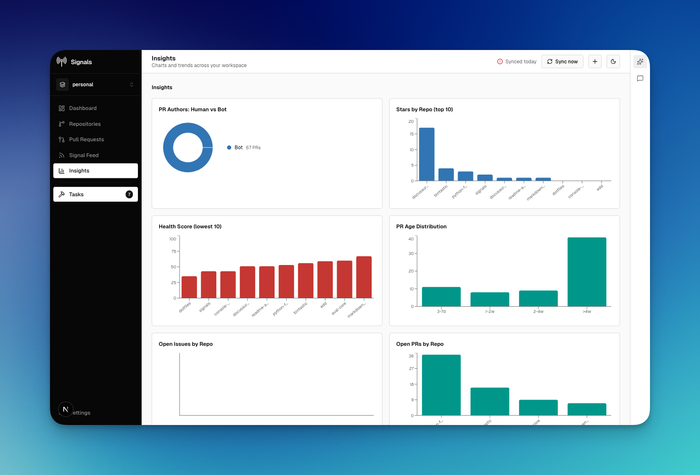
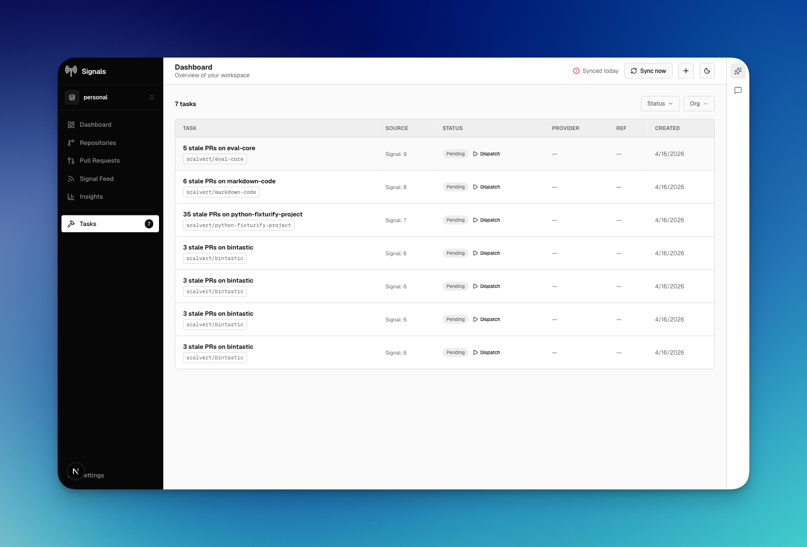
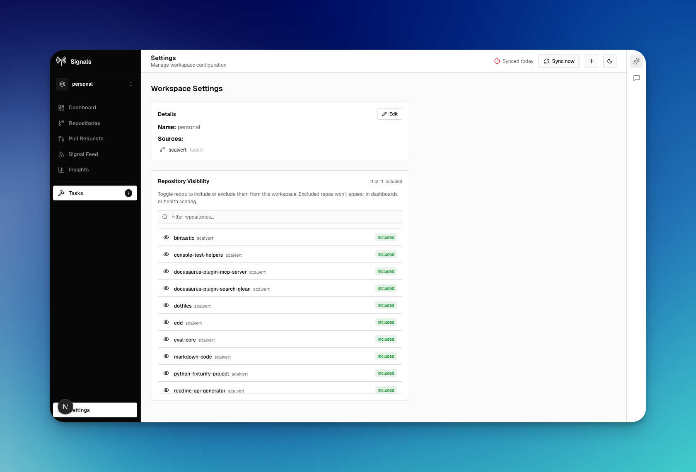
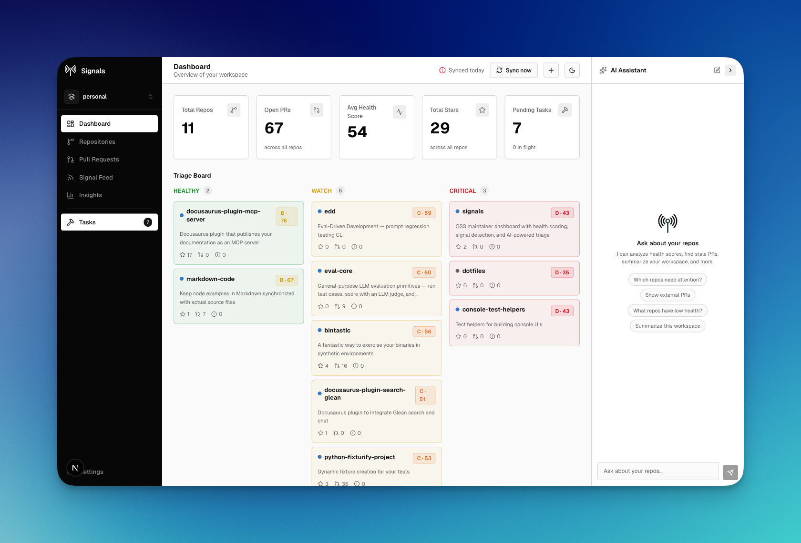

# UI Tour

A visual walkthrough of every screen in Signals.

## Setup

The welcome screen — sign in with your GitHub account to get started.

## Dashboard

The command center. Stat cards across the top, a triage board grouping repos by health (Healthy / Watch / Critical), and a recent tasks list at the bottom.

## Repositories

All repos in your workspace sorted by health score. Filter by org, language, or health grade.

## Pull Requests

Every open PR across all repos. Tabs filter by external, stale, CI failing, and draft.

## Signal Feed

Automated alerts for dormant repos, stale PRs, star milestones, and health drops. Severity badges (info / warning / critical) on the right.

## Signal Detail

Click any signal to see what happened, why it matters, and what to do about it.

## Insights

Charts and trends across your workspace — PR authors, stars by repo, health scores, PR age distribution, and more.

## Tasks

Actionable work items generated from signals. Dispatch tasks to Claude Code, Cursor, Codex, or a custom webhook.

## Settings

Workspace configuration — edit sources, toggle repo visibility, and manage workspace details.

## AI Assistant

A built-in chat panel powered by Claude. Ask questions about your repos using tool-calling against your live workspace data.

